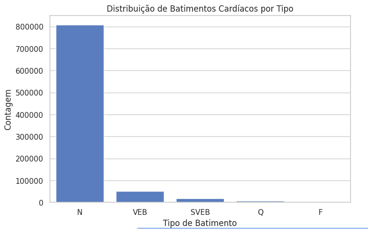
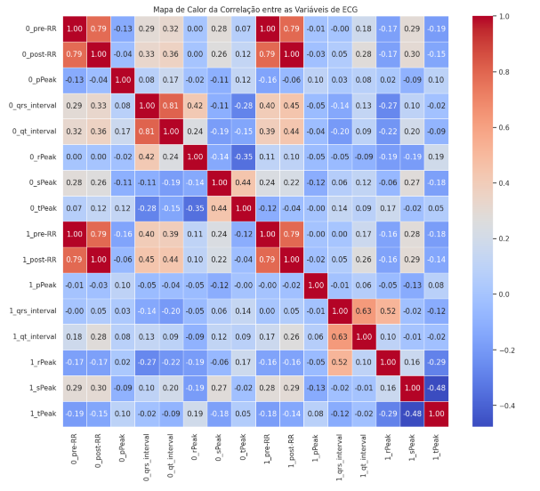

# FIAP - Faculdade de Informática e Administração Paulista

 

# Nome do projeto
CorAI | Batimentos de Dados – Mapeando o Coração Moderno

## 👨‍🎓 Integrantes: 
- <a href="https://www.linkedin.com/in/bryanjfagundes/">Bryan Fagundes</a>
- <a href="https://br.linkedin.com/in/brenner-fagundes">Brenner Fagundes</a>
- <a href="https://www.linkedin.com/in/diogo-botton-46ba49197/">Diogo Botton</a> 
- <a href="https://www.linkedin.com/in/hyankacoelho/">Hyanka Coelho</a> 
- <a href="https://www.linkedin.com/in/julianahungaro/">Juliana Hungaro Fidelis</a>

## 👩‍🏫 Professores:
### Tutor(a) 
- <a href="https://www.linkedin.com/in/leonardoorabona?utm_source=share&utm_campaign=share_via&utm_content=profile&utm_medium=android_app">Leonardo Ruiz Orabona</a>
### Coordenador(a)
- <a href="https://www.linkedin.com/in/andregodoichiovato/">André Godoi</a>

## 📜 Descrição

O projeto CorAI: Batimentos de Dados – Mapeando o Coração Moderno tem como foco a pesquisa, coleta e organização de três tipos fundamentais de dados relacionados à saúde cardiovascular, que serão a base para o desenvolvimento de modelos avançados de Machine Learning e Aprendizado Profundo. Nesta primeira fase, o desafio é levantar e estruturar:

- Dados Numéricos: Informações de pacientes cardíacos, como idade, pressão arterial, colesterol e outros indicadores clínicos essenciais.

- Dados Textuais: Artigos médicos e literários que abordam saúde cardiovascular e doenças cardíacas, oferecendo insights valiosos para análises via Processamento de Linguagem Natural (NLP).

- Imagens Médicas: Exames como ECGs, angiogramas e raios-X torácicos, que serão utilizados para a aplicação de técnicas de Visão Computacional com o objetivo de detectar padrões e anomalias.

## 📁 Estrutura de pastas

Dentre os arquivos e pastas presentes na raiz do projeto, definem-se:

- <b>src</b>: Todo o código fonte criado (futuramente).
- <b>docs</b>: Artigos médicos.

## 📋 Descrição dos datasets reunidos

Para atender às necessidades do projeto, identificamos dois datasets numéricos que se mostram bastante interessantes:

**Framingham Heart Study**

Este dataset provém de um estudo cardiovascular contínuo realizado em Framingham, Massachusetts. Com dados reais de pacientes, seu principal objetivo é prever o risco de desenvolver doença cardíaca coronária (DCC) em um período de até 10 anos. Para isso, o conjunto de dados contém diversos atributos relacionados à saúde e aos hábitos dos pacientes, como se o paciente é fumante, número de cigarros consumidos diariamente, presença de diabetes, pressão arterial, colesterol total, HDL, idade, entre outros. A variável "TenYearCHD" é fundamental, pois indica o risco da ocorrência de DCC, permitindo que médicos recomendem cuidados preventivos e intervenções adequadas. [Framingham Heart Study](https://www.kaggle.com/datasets/noeyislearning/framingham-heart-study)

Analise Exploratória

Nesta análise exploratória inicial, focaremos nas informações sobre sexo, idade e hábitos de fumar, que são particularmente relevantes para entender a saúde cardiovascular dos participantes.

**1. Distribuição da idade por Sexo**
   
Análise Demográfica e Tabagismo

A análise inicial dos dados demográficos revela que a idade média dos participantes é de 49,58 anos. A distribuição por gênero indica uma predominância do sexo feminino, representando 57,08% da amostra, enquanto o sexo masculino corresponde a 42,92%. Essa disparidade na distribuição de gênero pode introduzir um viés nos resultados da análise de risco cardiovascular.

Ao analisar a idade média em relação ao status de fumante, observamos:

- Não Fumantes: Idade média de 51,39 anos.
- Fumantes: Idade média de 47,73 anos.

Essa diferença sugere que, em média, os fumantes no estudo são mais jovens do que os não fumantes.

**2. Hábitos de Fumar**

A análise dos dados revela a seguinte proporção de fumantes no dataset:

- Fumantes Ativos: 49.41%
- Não Fumantes: 50.59%

Estes dados indicam uma distribuição equilibrada entre fumantes e não fumantes, o que é relevante para investigações sobre a influência do tabagismo na saúde cardiovascular.

Na análise dos dados referentes ao número de cigarros fumados por dia, os resultados se apresentam segmentados abaixo:

Grupo feminino:  
- Número de casos: 2.405
- Média de cigarros por dia: aproximadamente 5,73

Grupo masculino:  
- Número de casos: 1.806
- Média de cigarros por dia: aproximadamente 13,37

Essas estatísticas fornecem uma visão detalhada do consumo de cigarros diário entre os sexos que pode ser fundamental para análises que correlacionem o tabagismo com a saúde cardiovascular.

**ECG Arrhythmia Classification Dataset**

Este dataset se trata de uma base com dados reais que tem como origem dados obtidos do Physionet, onde há quatro conjuntos de dados de arritmia de exames de Eletrocardiograma (ECG) padronizados com as mesmas colunas para serem compatíveis entre si ao aplicar modelos de aprendizado de máquina. O conjunto de dados consolidado é robusto, com quase um milhão de registros, o que é ideal para o treinamento de modelos de aprendizado de máquina. A presença de 34 colunas sugere uma riqueza de características extraídas dos sinais de ECG.

Dentre as variáveis deste dataset, a coluna *"type"* contém a informação do tipo de arritmia detectada no paciente baseada nos sinais do exame ECG, assim como, as variáveis mais relevantes derivam do ritmo cardíaco, como intervalos entre batimentos (*pre-RR*, *post-RR*) ou duração de ondas (*qrs_interval*).

**Analise Exploratória**

Nesta análise exploratória inicial, avaliaremos a variavel alvo  *type* e as variaveis de interesse *pre-RR*, *post-RR*, *pPeak*, *qrs_interval*, *qt_interval*, *rPeak*, *sPeak*, *tPeak*

A análise da variável-alvo *type* é crucial para este projeto, pois ela define o tipo de batimento cardíaco, permitindo a classificação de arritmias. A distribuição de classes do dataset é altamente desbalanceada.

- Classe Majoritária: A classe N (Normal) domina, representando mais de 91% dos dados.
- Classes Minoritárias: As arritmias VEB e SVEB são minoritárias, enquanto Q e F são extremamente raras, com menos de 1% do total.

Esse desequilíbrio é um desafio crítico, pois caso não seja tratado, o modelo pode alcançar uma acurácia alta, mas falhar em detectar as arritmias mais importantes e raras.

As estatísticas descritivas para as variáveis de interesse *pre-RR*, *post-RR*, *pPeak*, *qrs_interval*, *qt_interval*, *rPeak*, *sPeak* e *tPeak* revelam uma ampla gama de valores. É notável a presença de outliers em quase todas as características, especialmente nos intervalos de batimento (pre-RR e post-RR) e nos intervalos morfológicos (qrs_interval e qt_interval). A identificação desses valores extremos é crucial para o pré-processamento de dados e para o desenvolvimento de um modelo robusto, pois podem influenciar negativamente o treinamento e a capacidade de generalização do modelo se não forem tratados adequadamente.

**Intervalos pre-RR e post-RR**
Derivação 0 (0_pre-RR, 0_post-RR): A mediana é de 202, e 75% dos valores estão abaixo de 258. No entanto, os valores máximos atingem 2228 e 10964, respectivamente. Essa enorme diferença indica que existem batimentos com intervalos extremamente longos, que podem ser sinal de ritmos cardíacos muito lentos ou falhas na medição.

Derivação 1 (1_pre-RR, 1_post-RR): O mesmo padrão é observado, com medianas de 185 e 238 no 75º percentil, mas valores máximos de 3666 e 10964. Isso reforça a presença de valores atípicos em ambas as derivações.

**Picos de Onda (pPeak, rPeak, sPeak, tPeak)**

As medianas e o 75º percentil para os picos de onda (tanto para as derivações 0 quanto 1) estão em faixas esperadas. No entanto, os valores máximos são consideravelmente mais altos, o que pode indicar anomalias na amplitude do sinal de ECG ou ruído.

É notável que o 1_rPeak e o 1_sPeak têm medianas negativas, o que é clinicamente plausível, já que o sinal de ECG pode ter deflexões para baixo dependendo da derivação.

**Intervalos Morfológicos (qrs_interval, qt_interval)**

- 0_qrs_interval: A mediana é 16 e 75% dos valores estão abaixo de 26, mas o máximo é 232. Um QRS prolongado é um forte indicador de arritmia ventricular, e o valor máximo sugere a presença desses casos.
- 1_qrs_interval: A mediana é 5 e o 75º percentil é 11, mas o valor máximo chega a 260. A diferença entre as medianas das duas derivações (16 vs. 5) é significativa e deve ser investigada.

**Heatmap**

O fato de 0_pre-RR e 1_pre-RR e também 0_qrs_interval e 1_qrs_interval apresentarem uma forte correlação no mapa de calor é um dos principais achados da análise. Essa alta correlação é, de fato, esperada, já que ambas as derivações medem o mesmo evento (o tempo entre batimentos e a duração do complexo QRS) em duas perspectivas diferentes.

**Próximos passos:**

- Balanceamento de Dados: Utilizar técnicas como Oversampling (ex: SMOTE) para aumentar as classes minoritárias ou Undersampling para reduzir a classe majoritária.
- Métricas de Avaliação: Avaliar o modelo com métricas como F1-Score, Precisão e Recall, que são mais confiáveis para datasets desbalanceados do que a acurácia.

Links para download:
- [Framingham Heart Study](https://fiapcom-my.sharepoint.com/:x:/g/personal/rm561051_fiap_com_br/ESgb8N8-8lRKuoD3Z31MmAcBAQR12jWdbxGIwcXywM2TFQ?e=DkMfpm)
- [ECG Arrhythmia Classification Dataset](https://fiapcom-my.sharepoint.com/:u:/g/personal/rm561051_fiap_com_br/EUL5r0U5bAhOnn2__Zy3ihgBHXxoLiQowgvPyvLmaE21LA?e=FyJnjr)

**Dataset de imagens:**

Para suprir a necessidade de uma base de dados de imagens decidimos usar o dataset [CheXpert-v1.0-small](https://www.kaggle.com/datasets/ashery/chexpert), uma versão menor do dataset original presente no site *Standford Machine Learning Group* que contém quase 500 GB de dados de imagens.

As imagens deste dataset são compostas por 224316 radiográfias (Raio X) do tórax de 65240 pacientes reais, apresentando vistas frontal e lateral. Este dataset possui rótulos de incerteza (-1: Incerto, 0: Não presente, 1: Doença presente) para cada label, assim como, um exame pode ter uma ou mais doenças detectadas (várias doenças ao mesmo tempo), portanto, o dataset é multi-label.

Dentre as variáveis deste dataset, as mais importantes são as colunas que definem se o paciente tem algum tipo de doença cardíaca, sendo elas: 

- *No Finding*: Nenhuma patologia encontrada no exame.
- *Enlarged Cardiomediastinum*: Alargamento do mediastino (região central do tórax, onde ficam o coração, aorta, traqueia, etc).
- *Cardiomegaly*: Refere-se ao aumento do tamanho do coração.
- *Lung Opacity*: Refere-se a qualquer área mais "branca" no pulmão que indique alteração de transparência.
- *Lung Lesion*: Refere-se a nódulos, massas ou lesões focais no pulmão.

Porém, como dito anteriormente, esses rótulos não estão em *one-hot encoding*. Cada célula pode ter valores de incerteza (-1), presença (1) ou ausência (0). Para simplificar o pré-processamento, poderíamos tratar valores -1 como 0 (não presente), reduzindo a complexidade na criação do modelo de CNN. Além disso, como esse dataset é multi-label, cada paciente pode ter múltiplas condições simultaneamente, o que é importante considerar no treinamento.

Link para download:
- [CheXpert-v1.0-small](https://fiapcom-my.sharepoint.com/:u:/g/personal/rm561051_fiap_com_br/EduH6j8yoVxFus50iMJ49HABVdVmI5VgHvKo_6zF0JNj-w?e=AJPOtx)

## 📋 Descrição dos artigos

**Revisão Bibliográfica: O Cenário das Doenças Cardiovasculares no Brasil**

**Introdução**
As doenças cardiovasculares (DCV) representam a principal causa de mortalidade no Brasil, impondo uma carga significativa sobre o sistema de saúde e a sociedade. Compreender a epidemiologia, o impacto econômico e as estratégias adotadas é fundamental para aprimorar as políticas de saúde pública. Esta revisão bibliográfica tem como objetivo sintetizar os achados mais relevantes de artigos e documentos publicados nos últimos cinco anos, abordando o panorama geral das DCV, sua relação com o Sistema Único de Saúde (SUS) e os avanços nos tratamentos. A análise se baseia em fontes oficiais e acadêmicas para traçar um quadro atualizado e preciso da situação no país.

**Metodologia**
A presente revisão é uma síntese narrativa de literatura, construída a partir da análise de documentos e artigos-chave publicados entre 2020 e 2024. As fontes consultadas incluem:

- Bases de dados acadêmicas, com ênfase na SciELO, que publica as estatísticas cardiovasculares anuais da Sociedade Brasileira de Cardiologia (SBC);
- Publicações oficiais do Ministério da Saúde e documentos do Sistema Único de Saúde (SUS), que detalham diretrizes e estratégias de atenção à saúde;
- Artigos de jornais e revistas especializadas que abordam a epidemiologia e o impacto econômico das DCV no Brasil.

A seleção dos materiais se concentrou em documentos que oferecem dados robustos, estatísticas oficiais e diretrizes para a prática clínica e a gestão em saúde pública. Para uma visualização clara das fontes utilizadas, a tabela a seguir resume os principais documentos, seus anos de publicação e temas abordados.

| Fonte | Título / Nome do Documento | Ano de Publicação | Tema Principal |
| :--- | :--- | :--- | :--- |
| SciELO / SBC | Estatística Cardiovascular – Brasil 2021 | 2021 | Epidemiologia, mortalidade e prevalência de DCV |
| SciELO / SBC | Estatística Cardiovascular – Brasil 2023 | 2023 | Dados atualizados de mortalidade, impacto da COVID-19 |
| SciELO | Impacto econômico dos casos de doença cardiovascular grave no Brasil | 2022 | Análise de custos diretos e indiretos das DCV |
| Ministério da Saúde (SUS) | Estratégia de Saúde Cardiovascular na Atenção Primária | 2022 | Diretrizes e políticas de prevenção e manejo na atenção primária |
| Sociedade Brasileira de Cardiologia | Estatísticas Cardiovasculares 2023 | 2023 | Análise do gasto do SUS com procedimentos cardiovasculares |
| BJHS | Epidemiologia das Internações por Insuficiência Cardíaca no Brasil | 2024 | Análise de tendências de internação por insuficiência cardíaca |

**Principais Achados**

**1.Epidemiologia e Impacto na Saúde Pública**

As Estatísticas Cardiovasculares publicadas anualmente pela SBC apontam que a doença arterial coronariana e o acidente vascular cerebral continuam sendo as principais causas de morte no Brasil. Embora a prevalência de DCV esteja em crescimento, impulsionada pelo envelhecimento da população, a taxa de mortalidade padronizada por idade tem apresentado uma leve redução, sugerindo uma melhora na qualidade dos cuidados.

O impacto financeiro das DCV é notável. Dados do SUS indicam que o gasto anual com procedimentos cardiovasculares ultrapassa a cifra de R$ 1 bilhão. O impacto da pandemia de COVID-19 também foi evidenciado, com uma redução inicial nas hospitalizações por algumas condições crônicas, seguida por um aumento da prevalência de fatores de risco como a hipertensão em determinadas regiões.

**2.O Papel do SUS e a Atenção Primária**

O SUS é o pilar no enfrentamento das DCV. Documentos do Ministério da Saúde, como a Estratégia de Saúde Cardiovascular na Atenção Primária, reforçam a importância da prevenção e do controle de fatores de risco como hipertensão, diabetes e dislipidemia. A atenção primária é vista como a porta de entrada e a principal ferramenta para a detecção precoce e o manejo inicial, evitando a progressão das doenças e a necessidade de procedimentos de alta complexidade.

A análise de dados do SUS revela um aumento de mais de 50% nas internações por infarto agudo do miocárdio na última década, refletindo a alta carga da doença. Em contrapartida, houve uma redução nas hospitalizações por insuficiência cardíaca, o que pode indicar um melhor manejo da condição.

**3.Avanços em Tratamentos e Prognóstico**
   
O cenário do tratamento das DCV tem apresentado avanços, principalmente no ambiente hospitalar. O aumento significativo no número de intervenções coronarianas percutâneas (ICP) primárias é um dos indicadores mais importantes, refletindo a ampliação do acesso a tratamentos de alta complexidade.

Apesar do aumento no volume de procedimentos, a taxa de mortalidade hospitalar por infarto agudo do miocárdio tem diminuído. Este dado sugere uma melhoria na qualidade do atendimento de emergência e no manejo clínico, resultando em um prognóstico mais favorável para os pacientes. O perfil dos pacientes em hospitais públicos, predominantemente homens e com múltiplos fatores de risco, reforça a necessidade contínua de estratégias preventivas e de educação em saúde.

**Potencial de Análise dos Textos por Algoritmos de Processamento de Linguagem Natural (NLP)**

A exploração desses textos por algoritmos de NLP é crucial para projetos de Inteligência Artificial na área da saúde. Os documentos, repletos de informações não-estruturadas, podem ser transformados em dados valiosos e acionáveis.

**Como usar os algoritmos de NLP**

**Análise de Sentimentos:** A análise de sentimento pode ser aplicada para avaliar o tom de relatórios oficiais ou o sentimento expresso em documentos de resposta pública. Por exemplo, a IA pode classificar a percepção geral sobre o sucesso de um programa de prevenção cardiovascular como "otimista" ou "cautelosa", ajudando a entender a visão dos profissionais e gestores sobre as políticas adotadas.

**Extração de Sintomas e Entidades Clínicas:** Algoritmos de extração de informação (como a Extração de Entidades Nomeadas) conseguem rastrear os textos para identificar automaticamente sintomas (ex: dor no peito, falta de ar), doenças (ex: hipertensão, diabetes), e tratamentos (ex: ICP, angioplastia). Essa técnica permite criar um banco de dados estruturado a partir de relatórios e artigos extensos.

**Classificação de Tópicos:** Uma das aplicações mais diretas é a classificação de documentos. Os textos podem ser categorizados em temas como "Custo para o SUS," "Tendências de Mortalidade," ou "Estratégias de Prevenção." Essa classificação automática facilita a organização e a busca em grandes repositórios de literatura médica, permitindo que pesquisadores e gestores encontrem rapidamente o que precisam.

**Relevância dessas análises para um projeto de IA na saúde**

Essas análises são a base para a criação de sistemas inteligentes que podem gerar insights em larga escala. A relevância reside em:

**Escalabilidade e Eficiência:** A leitura e análise manual de milhares de relatórios e artigos é inviável. Algoritmos de NLP podem processar essa massa de dados em minutos, revelando padrões e tendências que seriam impossíveis de detectar manualmente.

**Apoio à Tomada de Decisão:** Os dados extraídos podem alimentar painéis de controle para gestores de saúde, alertando sobre o aumento de um sintoma específico em relatórios de diferentes hospitais ou identificando quais estratégias de tratamento estão sendo mais discutidas e associadas a melhores resultados.

**Previsão e Planejamento:** Ao correlacionar a extração de sintomas com dados de internação, um modelo de IA pode prever a demanda futura por leitos ou equipamentos em certas regiões. A análise de sentimentos e a classificação de tópicos podem ajudar a otimizar a alocação de recursos financeiros para as áreas mais críticas da saúde pública.

A Inteligencia Artificial, usando o Processamento de Linguagem Natural (NLP), pode transformar textos em inteligência estratégica. Além de organizar as informações, ela as utiliza para criar modelos preditivos e sistemas de suporte à decisão. Em última análise, essa tecnologia pode ajudar a salvar vidas e a otimizar a gestão do sistema de saúde.

## 📋 Licença

<a property="dct:title" rel="cc:attributionURL" href="https://github.com/agodoi/template">MODELO GIT FIAP</a> por <a rel="cc:attributionURL dct:creator" property="cc:attributionName" href="https://fiap.com.br">Fiap</a> está licenciado sobre <a href="http://creativecommons.org/licenses/by/4.0/?ref=chooser-v1" target="_blank" rel="license noopener noreferrer" style="display:inline-block;">Attribution 4.0 International</a>.

