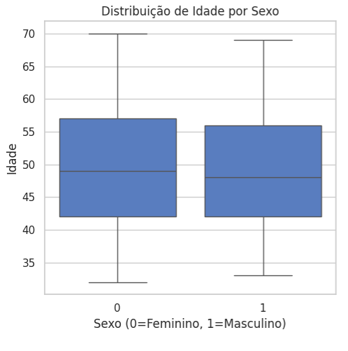
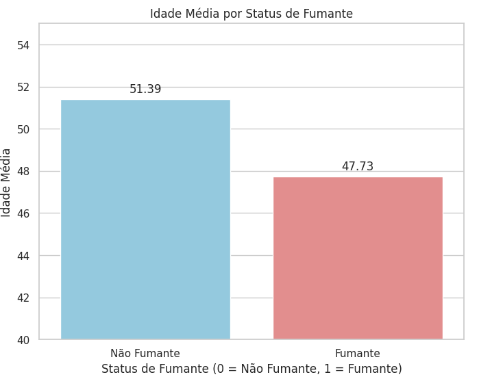
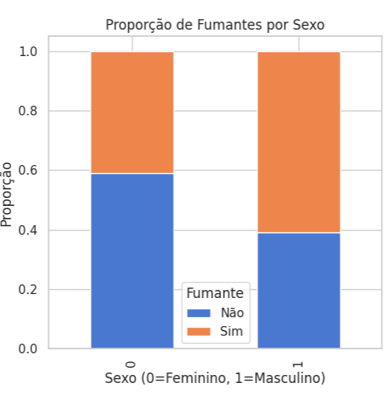
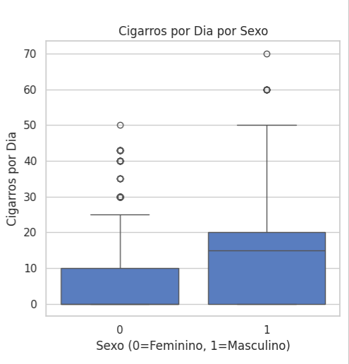

# FIAP - Faculdade de Informática e Administração Paulista

 

# Nome do projeto
CorAI | Batimentos de Dados – Mapeando o Coração Moderno

## 👨‍🎓 Integrantes: 
- <a href="https://www.linkedin.com/in/bryanjfagundes/">Bryan Fagundes</a>
- <a href="https://br.linkedin.com/in/brenner-fagundes">Brenner Fagundes</a>
- <a href="https://www.linkedin.com/in/diogo-botton-46ba49197/">Diogo Botton</a> 
- <a href="https://www.linkedin.com/in/hyankacoelho/">Hyanka Coelho</a> 
- <a href="https://www.linkedin.com/in/julianahungaro/">Juliana Hungaro Fidelis</a>

## 👩‍🏫 Professores:
### Tutor(a) 
- <a href="https://www.linkedin.com/in/leonardoorabona?utm_source=share&utm_campaign=share_via&utm_content=profile&utm_medium=android_app">Leonardo Ruiz Orabona</a>
### Coordenador(a)
- <a href="https://www.linkedin.com/in/andregodoichiovato/">André Godoi</a>

## 📜 Descrição

O projeto CorAI: Batimentos de Dados – Mapeando o Coração Moderno tem como foco a pesquisa, coleta e organização de três tipos fundamentais de dados relacionados à saúde cardiovascular, que serão a base para o desenvolvimento de modelos avançados de Machine Learning e Aprendizado Profundo. Nesta primeira fase, o desafio é levantar e estruturar:

- Dados Numéricos: Informações de pacientes cardíacos, como idade, pressão arterial, colesterol e outros indicadores clínicos essenciais.

- Dados Textuais: Artigos médicos e literários que abordam saúde cardiovascular e doenças cardíacas, oferecendo insights valiosos para análises via Processamento de Linguagem Natural (NLP).

- Imagens Médicas: Exames como ECGs, angiogramas e raios-X torácicos, que serão utilizados para a aplicação de técnicas de Visão Computacional com o objetivo de detectar padrões e anomalias.

## 📁 Estrutura de pastas

Dentre os arquivos e pastas presentes na raiz do projeto, definem-se:

- <b>src</b>: Todo o código fonte criado (futuramente).
- <b>docs</b>: Artigos médicos.

## 📋 Descrição dos datasets reunidos

Para atender às necessidades do projeto, identificamos dois datasets numéricos que se mostram bastante interessantes:

**Framingham Heart Study**

Este dataset provém de um estudo cardiovascular contínuo realizado em Framingham, Massachusetts. Com dados reais de pacientes, seu principal objetivo é prever o risco de desenvolver doença cardíaca coronária (DCC) em um período de até 10 anos. Para isso, o conjunto de dados contém diversos atributos relacionados à saúde e aos hábitos dos pacientes, como se o paciente é fumante, número de cigarros consumidos diariamente, presença de diabetes, pressão arterial, colesterol total, HDL, idade, entre outros. A variável "TenYearCHD" é fundamental, pois indica o risco da ocorrência de DCC, permitindo que médicos recomendem cuidados preventivos e intervenções adequadas. [Framingham Heart Study](https://www.kaggle.com/datasets/noeyislearning/framingham-heart-study)

Analise Exploratória

Nesta análise exploratória inicial, focaremos nas informações sobre sexo, idade e hábitos de fumar, que são particularmente relevantes para entender a saúde cardiovascular dos participantes.

**1. Distribuição da idade por Sexo**
   
Análise Demográfica e Tabagismo

A análise inicial dos dados demográficos revela que a idade média dos participantes é de 49,58 anos. A distribuição por gênero indica uma predominância do sexo feminino, representando 57,08% da amostra, enquanto o sexo masculino corresponde a 42,92%. Essa disparidade na distribuição de gênero pode introduzir um viés nos resultados da análise de risco cardiovascular.

Ao analisar a idade média em relação ao status de fumante, observamos:

- Não Fumantes: Idade média de 51,39 anos.
- Fumantes: Idade média de 47,73 anos.

Essa diferença sugere que, em média, os fumantes no estudo são mais jovens do que os não fumantes.

**2. Hábitos de Fumar**

A análise dos dados revela a seguinte proporção de fumantes no dataset:

- Fumantes Ativos: 49.41%
- Não Fumantes: 50.59%

Estes dados indicam uma distribuição equilibrada entre fumantes e não fumantes, o que é relevante para investigações sobre a influência do tabagismo na saúde cardiovascular.

Na análise dos dados referentes ao número de cigarros fumados por dia, os resultados se apresentam segmentados abaixo:

Grupo feminino:  
- Número de casos: 2.405
- Média de cigarros por dia: aproximadamente 5,73

Grupo masculino:  
- Número de casos: 1.806
- Média de cigarros por dia: aproximadamente 13,37

Essas estatísticas fornecem uma visão detalhada do consumo de cigarros diário entre os sexos que pode ser fundamental para análises que correlacionem o tabagismo com a saúde cardiovascular.

- parei aqui

- 
- [ECG Arrhythmia Classification Dataset](https://www.kaggle.com/datasets/sadmansakib7/ecg-arrhythmia-classification-dataset)

O **1° dataset (Framingham Heart Study)** é um estudo cardiovascular em andamento em Framingham, Massachusetts. Se trata de um dataset com dados reais de pacientes e tem como objetivo realizar uma predição de risco de uma pessoa ter a doença cardíaca coronária (DCC) em até 10 anos com base em vários atributos que indicam o estado de saúde do paciente.

As variáveis mais relevantes deste dataset seriam, basicamente, as informações que tem mais correlação com hábitos e saúde do paciente, como por exemplo, indicação se o paciente é fumante e número de cigarros por dia, se o paciente tem diabetes, pressão arterial, colesterol total, HDL, idade, etc. Estas variáveis serão importantes para definir se uma pessoa tem o risco de ter a doença cardíaca coronária em até 10 anos. Com este resultado em mãos os médicos poderiam recomendar os devidos cuidados com a saúde do paciente, visando evitar que realmente o mesmo tenha essa doença futuramente. A coluna *"TenYearCHD"* é responsável por indicar o risco da doença cardíaca coronária no paciente.

O **2° dataset (ECG Arrhythmia Classification Dataset)** se trata de uma base com dados reais que tem como origem dados obtidos do Physionet, onde há quatro conjuntos de dados de arritmia de exames de Eletrocardiograma (ECG) padronizados com as mesmas colunas para serem compatíveis entre si ao aplicar modelos de aprendizado de máquina.

Dentre as variáveis deste dataset, a coluna *"type"* contém a informação do tipo de arritmia detectada no paciente baseada nos sinais do exame ECG, assim como, as variáveis mais relevantes derivam do ritmo cardíaco, como intervalos entre batimentos (*pre-RR*, *post-RR*) ou duração de ondas (*qrs_interval*).

Links para download:
- [Framingham Heart Study](https://fiapcom-my.sharepoint.com/:x:/g/personal/rm561051_fiap_com_br/ESgb8N8-8lRKuoD3Z31MmAcBAQR12jWdbxGIwcXywM2TFQ?e=DkMfpm)
- [ECG Arrhythmia Classification Dataset](https://fiapcom-my.sharepoint.com/:u:/g/personal/rm561051_fiap_com_br/EUL5r0U5bAhOnn2__Zy3ihgBHXxoLiQowgvPyvLmaE21LA?e=FyJnjr)

**Dataset de imagens:**

Para suprir a necessidade de uma base de dados de imagens decidimos usar o dataset [CheXpert-v1.0-small](https://www.kaggle.com/datasets/ashery/chexpert), uma versão menor do dataset original presente no site *Standford Machine Learning Group* que contém quase 500 GB de dados de imagens.

As imagens deste dataset são compostas por 224316 radiográfias (Raio X) do tórax de 65240 pacientes reais, apresentando vistas frontal e lateral. Este dataset possui rótulos de incerteza (-1: Incerto, 0: Não presente, 1: Doença presente) para cada label, assim como, um exame pode ter uma ou mais doenças detectadas (várias doenças ao mesmo tempo), portanto, o dataset é multi-label.

Dentre as variáveis deste dataset, as mais importantes são as colunas que definem se o paciente tem algum tipo de doença cardíaca, sendo elas: 

- *No Finding*: Nenhuma patologia encontrada no exame.
- *Enlarged Cardiomediastinum*: Alargamento do mediastino (região central do tórax, onde ficam o coração, aorta, traqueia, etc).
- *Cardiomegaly*: Refere-se ao aumento do tamanho do coração.
- *Lung Opacity*: Refere-se a qualquer área mais "branca" no pulmão que indique alteração de transparência.
- *Lung Lesion*: Refere-se a nódulos, massas ou lesões focais no pulmão.

Porém, como dito anteriormente, esses rótulos não estão em *one-hot encoding*. Cada célula pode ter valores de incerteza (-1), presença (1) ou ausência (0). Para simplificar o pré-processamento, poderíamos tratar valores -1 como 0 (não presente), reduzindo a complexidade na criação do modelo de CNN. Além disso, como esse dataset é multi-label, cada paciente pode ter múltiplas condições simultaneamente, o que é importante considerar no treinamento.

Link para download:
- [CheXpert-v1.0-small](https://fiapcom-my.sharepoint.com/:u:/g/personal/rm561051_fiap_com_br/EduH6j8yoVxFus50iMJ49HABVdVmI5VgHvKo_6zF0JNj-w?e=AJPOtx)

## 📋 Licença

<a property="dct:title" rel="cc:attributionURL" href="https://github.com/agodoi/template">MODELO GIT FIAP</a> por <a rel="cc:attributionURL dct:creator" property="cc:attributionName" href="https://fiap.com.br">Fiap</a> está licenciado sobre <a href="http://creativecommons.org/licenses/by/4.0/?ref=chooser-v1" target="_blank" rel="license noopener noreferrer" style="display:inline-block;">Attribution 4.0 International</a>.

